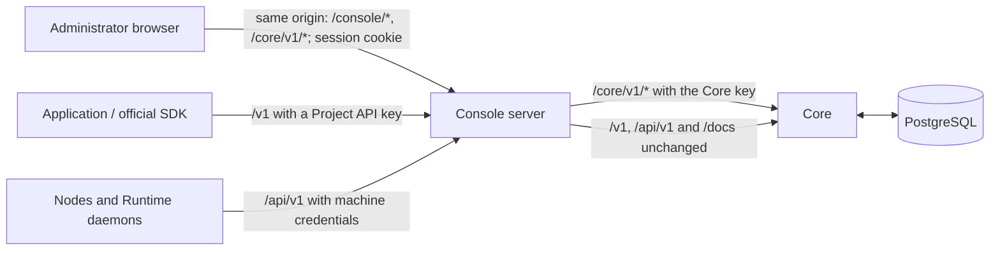

The console server (`services/web`, the `oac-web` process) serves the built console, signs the administrator in with the Core key and forwards the signed-in browser's `/core/v1` requests to Core with that key. The browser never holds the Core key or any API key. Applications, nodes and self-hosted executors reach Core through the console, which forwards `/v1`, `/api/v1` and `/docs` unchanged.

[Configuration](../configuration.md#appendix-web-environment-without-the-installer) owns its process settings and defaults.

## Request boundary

The deployment's reverse proxy sends every path to the console. The console forwards `/v1`, `/api/v1` and `/docs` to Core and serves everything else itself; the [installation options](../getting-started/install-options.md#https-and-the-reverse-proxy) gives the proxy requirements. The console handles each path as follows:

| Path | Sign-in | Handling |
| --- | --- | --- |
| `/healthz` | No | `GET` or `HEAD` answers `200 ok` |
| `/v1`, `/api/v1` and below | — | Forwarded to Core unchanged, with the caller's credential, streaming and WebSocket upgrades |
| `/docs`, `/docs/*` | No | The API reference and its OpenAPI documents, forwarded to Core unchanged |
| `/node-install/*` | No | The node installation payload (see [Node installation payload](#node-installation-payload)) |
| `/console/auth`, `/console/auth/login`, `/console/auth/logout` | No | [Sign-in](#sign-in) |
| `/`, `/index.html`, `/favicon.svg`, `/oac-mark.svg`, `/assets/*` | No | Static console assets |
| `/console/config` | Yes | [Console configuration](#console-configuration) |
| `/core/v1/*` | Yes | [Forwarded to Core](#forwarding-to-core) |
| `/core` and other paths under `/core/` | Yes | 404 |
| Any other path | Yes | Static assets; a path without a file extension falls back to `index.html` |

Every request except `/healthz`, `/v1`, `/api/v1` and `/docs` must pass these checks first:

1. **Host and origin.** The `Host` header must equal the host of `OAC_WEB_ORIGIN`. An `Origin` header, when present, must equal that origin, and `Sec-Fetch-Site` must be `same-origin` or `none`. A write that carries neither `Origin` nor `Sec-Fetch-Site: same-origin` needs a same-origin `Referer`. Otherwise the console answers 403. `/node-install/*` checks only the host and the path.
2. **Safe request.** The path must start with `/` and contain no `%`, backslash, NUL, dot segment or empty segment. Absolute-form request targets, `CONNECT` and `TRACE` get 400. An `Upgrade` header gets 400 except on `/v1`, `/api/v1` and `/docs`, which are forwarded before these checks. A `/core/v1` request can therefore never leave that prefix.
3. **Sign-in.** Paths that need sign-in answer 401 without a valid session cookie.

Under `/core`, these failures use the Core error envelope with the codes in [console-generated failures](../../contracts/agents-api/core-errors.md#console-generated-failures); elsewhere they return `{"error": "…"}`, or plain text for an unsafe request. Every response carries `Cache-Control: no-store`, `X-Content-Type-Options: nosniff`, `Referrer-Policy: no-referrer` and `Content-Security-Policy: frame-ancestors 'none'`.

## Forwarding to Core

The console forwards each signed-in `/core/v1/*` request by prefix to `OAC_WEB_UPSTREAM`, with its path and query unchanged. Core alone decides whether the route exists, and its responses and errors pass through unchanged. The console therefore needs no change when Core adds a `/core/v1` route.

On the way to Core, the console:

- removes the browser's `Authorization`, `Proxy-Authorization`, `Cookie`, `Origin` and `Referer` headers;
- sends `Authorization: Bearer <Core key>`;
- sets `X-Core-Console-Actor: console`, replacing any value the browser sent. Core records it as a display-only audit label ([administrator API](../../contracts/agents-api/admin-api.md));
- ignores ambient HTTP proxy settings, so the Core key reaches only the configured Core;
- streams responses without buffering.

On the way back, it removes `Set-Cookie`, `WWW-Authenticate`, `Location`, `Refresh` and every `Access-Control-*` header. A redirect from Core, or a failed connection to Core, becomes 502 `core_unreachable`.

The console never retries a request. Browser code calls `/core/v1` through the typed clients in [`packages/agents-client`](https://github.com/MiniMax-AI/OpenAgentCore/blob/main/packages/agents-client/README.md); [console API usage](./console-api-usage.md) lists what each page reads and writes.

## Sign-in

| Method and route | Request | Result |
| --- | --- | --- |
| `GET /console/auth` | No body | `200 {"mode":"login"}` or `200 {"mode":"authenticated"}` |
| `POST /console/auth/login` | `Content-Type: application/json`; body `{"core_key":"…"}` with no other member, at most 4 KiB | `200 {"mode":"authenticated"}` and the session cookie |
| `POST /console/auth/logout` | No body | `200 {"mode":"login"}`; ends the session and clears the cookie |

The administrator signs in with the deployment's [Core key](../getting-started/operations.md#core-key). There are no console accounts, usernames or setup step, and signing in grants the whole console.

- The console compares SHA-256 digests of the submitted and configured keys in constant time. It never logs or returns the key.
- The session cookie `core_console_session` is HttpOnly, `SameSite=Strict`, and `Secure` when `OAC_WEB_ORIGIN` is HTTPS. It lasts 12 hours.
- Sessions live only in the console's memory, at most 64 at a time; the oldest is dropped first. A console restart or a Core key rotation signs everyone out.
- At most two sign-in checks run at once; another attempt gets 429 with `Retry-After: 1`.
- Failed attempts share a budget of 10 per minute; beyond it, a wrong key gets 429 with `Retry-After: 60`. The correct key always signs in, which is why the console refuses to start with a Core key shorter than 32 characters.

Sign-in errors: 400 for a malformed body, 401 `Invalid Core key`, 405 for a method other than `POST`, 415 for a body that is not JSON, 429 as above, and 503 when the console cannot create a session.

## Console configuration

`GET /console/config` returns what the signed-in browser needs to add nodes:

| Field | Meaning |
| --- | --- |
| `node_installer` | Whether the console serves a node installation payload |
| `node_installer_sha256` | SHA-256 of that payload's `node-install.pyz`; Add node commands verify it before running the installer |
| `node_artifacts` | The providers (`docker`, `microsandbox`) whose node artifacts the payload holds, locally or as a pinned release download. Read on every request, so artifacts added by rerunning the installer appear without a restart |

## Node installation payload

With `OAC_WEB_NODE_PAYLOAD_DIR` set, the console serves the matched distribution's node payload at `/node-install/` without sign-in: `node-install.pyz`, `manifest.json`, `SHA256SUMS`, `runtime/seccomp.json`, and the node artifacts the manifest declares under `artifacts/`. An artifact missing locally redirects (307) to its pinned release download. Node install and uninstall commands download from `<public_url>/node-install/`, so the reverse proxy must send that path to the console. Nodes verify every checksum themselves.

## Public address

The console does not configure a domain or obtain certificates. The operator's reverse proxy or hosting platform terminates HTTPS and routes to the console, and `OAC_PUBLIC_URL` records the origin that applications, nodes and executors use. The console accepts only the host of `OAC_WEB_ORIGIN`, so DNS rebinding cannot reach it. A development installation with `OAC_ALLOW_INSECURE_ORIGIN=1` may record a non-loopback `http://` origin; Add node and the host cleanup then offer plain-HTTP commands, and Add node warns that the enrollment token and the node's credentials travel unencrypted.

## Verification

After installing or changing the console, check:

1. `GET /healthz` on the console and on Core. Each proves only that the process answers.
2. Sign in, then read `GET /core/v1/projects` in the browser. This proves the browser-to-console and console-to-Core path and the console's Core key.
3. A Project API key works on `/v1` and fails on `/core/v1`. The Core key fails on `/v1`, and `/v1` sent to the console answers 404.
4. A cross-origin write to the console is rejected, and a forged `X-Core-Console-Actor` header does not change the audit label.
5. Neither sign-in nor the sandbox deployment read (`GET /core/v1/sandbox/deployment`) proves that a model or a sandbox is ready. Runtime observations and history report execution separately.

A sign-in failure belongs to the console. A 401 from Core on a signed-in request means the console's Core key does not match Core's digest, or the console reaches the wrong Core. The [troubleshooting table](../getting-started/operations.md#troubleshooting) covers the common symptoms.
