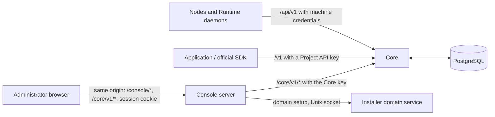

控制台服务器（`services/web`、`oac-web` 进程）提供构建后的控制台，使用 Core 密钥认证管理员，并将已登录浏览器的 `/core/v1` 请求携带该密钥转发到 Core。浏览器不持有 Core 密钥或任何 API 密钥。应用、节点和自托管执行器直接调用 Core；控制台不转发这些流量。

[配置](../configuration.md#appendix-web-environment-without-the-installer)定义其进程设置和默认值。

## 请求边界 {#request-boundary}

部署的反向代理将 `/v1` 和 `/api/v1` 路由到 Core，其余路径路由到控制台；[安装选项](../getting-started/install-options.md#https-and-the-reverse-proxy)列出路由。控制台按如下方式处理路径：

| 路径 | 需要登录 | 处理方式 |
| --- | --- | --- |
| `/healthz` | 否 | `GET` 或 `HEAD` 返回 `200 ok` |
| `/v1`、`/api/v1` 及其下级路径 | — | 无论请求携带何种凭据均为 404 |
| `/node-install/*` | 否 | 节点安装文件（参阅[节点安装文件](#node-installation-payload)） |
| `/console/auth`、`/console/auth/login`、`/console/auth/logout` | 否 | [登录](#sign-in) |
| `/`、`/index.html`、`/favicon.svg`、`/oac-mark.svg`、`/assets/*` | 否 | 控制台静态资源 |
| `/console/config` | 是 | [控制台配置](#console-configuration) |
| `/console/installation/domain` | 是 | [域名设置](#domain-setup) |
| `/core/v1/*` | 是 | [转发到 Core](#forwarding-to-core) |
| `/core` 及 `/core/` 下其他路径 | 是 | 404 |
| 其他路径 | 是 | 静态资源；无扩展名的路径回退到 `index.html` |

除 `/healthz`、`/v1` 和 `/api/v1` 外，每个请求首先必须通过这些检查：

1. **Host 与来源。** `Host` 请求头必须等于 `OAC_WEB_ORIGIN` 的主机。存在 `Origin` 时必须等于该来源，`Sec-Fetch-Site` 必须为 `same-origin` 或 `none`。写请求既无 `Origin` 又无 `Sec-Fetch-Site: same-origin` 时，需要同源 `Referer`。否则控制台返回 403。`/node-install/*` 仅检查主机和路径。
2. **安全请求。** 路径必须以 `/` 开头，不含 `%`、反斜杠、NUL、点路径段或空路径段。绝对形式请求目标、`CONNECT`、`TRACE` 及包含 `Upgrade` 头的请求返回 400。因此请求无法离开 Core 的 `/core/v1`，控制台也不承载 WebSocket。
3. **登录。** 需要登录的路径在无有效会话 cookie 时返回 401。

`/core` 下，这些失败使用 Core 错误封装和[控制台生成的失败](../../../contracts/agents-api/zh/core-errors.md#console-generated-failures)中的代码；其他位置返回 `{"error": "…"}`，不安全请求则返回纯文本。每个响应包含 `Cache-Control: no-store`、`X-Content-Type-Options: nosniff`、`Referrer-Policy: no-referrer` 和 `Content-Security-Policy: frame-ancestors 'none'`。

## 转发到 Core {#forwarding-to-core}

控制台按前缀将每个已登录的 `/core/v1/*` 请求转发到 `OAC_WEB_UPSTREAM`，路径和查询不变。只有 Core 判断路由是否存在，其响应和错误原样传回。因此 Core 添加 `/core/v1` 路由时无需修改控制台。

向 Core 转发时，控制台：

- 移除浏览器的 `Authorization`、`Proxy-Authorization`、`Cookie`、`Origin` 和 `Referer` 请求头；
- 发送 `Authorization: Bearer <Core key>`；
- 设置 `X-Core-Console-Actor: console`，替换浏览器提供的值。Core 将它记录为仅用于展示的审计标签（[管理员 API](../../../contracts/agents-api/zh/admin-api.md)）；
- 忽略环境中的 HTTP 代理设置，确保 Core 密钥仅发送到配置的 Core；
- 流式转发响应，不缓冲。

返回时移除 `Set-Cookie`、`WWW-Authenticate`、`Location`、`Refresh` 和所有 `Access-Control-*` 响应头。Core 的重定向或连接失败转换为 502 `core_unreachable`。

控制台不重试请求。浏览器代码通过 [`packages/agents-client`](https://github.com/MiniMax-AI/OpenAgentCore/blob/main/packages/agents-client/README.md) 的类型化客户端调用 `/core/v1`；[控制台 API 使用](console-api-usage.md)列出各页面读写内容。

## 登录 {#sign-in}

| 方法和路由 | 请求 | 结果 |
| --- | --- | --- |
| `GET /console/auth` | 无请求体 | `200 {"mode":"login"}` 或 `200 {"mode":"authenticated"}` |
| `POST /console/auth/login` | `Content-Type: application/json`；请求体 `{"core_key":"…"}`，不可含其他成员，最多 4 KiB | `200 {"mode":"authenticated"}` 及会话 cookie |
| `POST /console/auth/logout` | 无请求体 | `200 {"mode":"login"}`；结束会话并清除 cookie |

管理员使用部署的 [Core 密钥](../getting-started/operations.md#core-key)登录。没有控制台账号、用户名或设置步骤，登录授予整个控制台访问权限。

- 控制台以恒定时间比较提交密钥与配置密钥的 SHA-256 摘要，不记录或返回密钥。
- 会话 cookie `core_console_session` 为 HttpOnly、`SameSite=Strict`，`OAC_WEB_ORIGIN` 为 HTTPS 时还设置 `Secure`。有效期 12 小时。
- 会话仅存在控制台内存中，最多同时 64 个，先移除最旧的。重启控制台或轮换 Core 密钥会让所有用户退出登录。
- 同时最多执行两次登录检查；额外尝试返回 429 和 `Retry-After: 1`。
- 失败尝试共享每分钟 10 次预算；超出后，错误密钥返回 429 和 `Retry-After: 60`。正确密钥始终可以登录，因此控制台拒绝使用少于 32 字符的 Core 密钥启动。

登录错误：请求体格式错误为 400，错误密钥为 401 `Invalid Core key`，非 `POST` 方法为 405，非 JSON 请求体为 415，上述频率限制为 429，无法创建会话为 503。

## 控制台配置 {#console-configuration}

`GET /console/config` 返回已登录浏览器添加节点所需的信息：

| 字段 | 含义 |
| --- | --- |
| `node_installer` | 控制台是否提供节点安装文件 |
| `node_installer_sha256` | 文件中 `node-install.pyz` 的 SHA-256；Add node 命令执行安装程序前验证它 |
| `node_artifacts` | 文件中包含节点资产的提供商（`docker`、`microsandbox`），资产在本地或通过固定发行下载提供。每次请求都读取，因此重新运行安装程序新增的资产无需重启即可出现 |
| `allow_insecure_origin` | 该安装是否允许非回环的 HTTP 公开 URL：`config.json` 的 `allow_insecure_origin`，派生为 `OAC_ALLOW_INSECURE_ORIGIN`。开启后 Add node 会提供明文 HTTP 命令，并警告凭据会以明文传输；默认关闭 |

## 节点安装文件 {#node-installation-payload}

设置 `OAC_WEB_NODE_PAYLOAD_DIR` 后，控制台在 `/node-install/` 无需登录地提供匹配发行版的节点文件：`node-install.pyz`、`manifest.json`、`SHA256SUMS`、`runtime/seccomp.json`，以及清单声明的 `artifacts/` 下节点资产。本地缺失的资产重定向（307）到固定发行下载地址。节点安装和卸载命令从 `<public_url>/node-install/` 下载，因此反向代理必须将该路径发给控制台。节点自行验证每个校验和。

## 域名设置 {#domain-setup}

`GET` 和 `POST /console/installation/domain` 使 **System → Domain and HTTPS** 能配置托管安装的域名。这是控制台路由，不是 Core 路由。通过同源与登录检查后，控制台将最多 2 KiB 的请求体传给 `OAC_WEB_INSTALLATION_SOCKET` 的安装程序 Unix 套接字，使用 Core 密钥认证，并返回安装程序 JSON 响应和状态。请求在 20 秒后超时。

| 方法 | 请求 | 结果 |
| --- | --- | --- |
| `GET` | 无请求体 | 域名状态 |
| `POST` | `{"hostname":"core.example.com"}`，可附加 `"confirm_public_url_change":"https://core.example.com"` | 202 和状态；安装程序在后台检查并应用域名 |

状态包含 `supported`、`state`（`unconfigured`、`checking`、`applying`、`ready` 或 `failed`），以及可为 null 的 `public_url`、`target_url` 和 `message`。安装程序错误使用 `{"error":{"code":"…","message":"…"}}`。修改节点或执行器已使用的地址时，在请求确认新 URL 前返回 409 `public_url_confirmation_required`；待应用的 `config.json` 修改、未应用或未运行的安装、手动修改的生成文件，以及其他安装操作持有锁（`installation_busy`）也返回 409。

未设置 `OAC_WEB_INSTALLATION_SOCKET` 时（外部反向代理安装），`GET` 报告 `supported: false`，`POST` 返回 400 `domain_setup_unavailable`。安装程序不可达或响应无效时返回 502 `installation_unreachable`。

System 页面仅提交一次主机名，在状态为 `checking` 或 `applying` 时每 2 秒轮询；安装程序要求时请求确认。设置期间，网络失败和 HTTP 502/503/504 响应不会停止轮询。30 秒内没有成功状态响应后，页面展示断连消息；下一次轮询成功即恢复。不重试写入。应用域名会重启控制台并结束全部会话；页面保留到新 HTTPS 地址的登录链接。只有 `ready` 状态确认 HTTPS；浏览器不探测新来源。安装程序负责证书、锁定与恢复（[托管 HTTPS](https://github.com/MiniMax-AI/OpenAgentCore/blob/main/deploy/install/README.md#managed-https)）。

安装程序在未配置公开 URL 时设置 `OAC_WEB_BOOTSTRAP=1`，让控制台也接受以字面 IP 地址访问的明文 HTTP 请求，并将 `http://<that address>` 视为来源，使运维人员能通过服务器 IP 登录。主机名仍必须符合 `OAC_WEB_ORIGIN`，因此 DNS 重绑定不能访问控制台。

## 验证 {#verification}

安装或修改控制台后，检查：

1. 控制台与 Core 的 `GET /healthz`。各自只证明进程响应。
2. 登录后在浏览器读取 `GET /core/v1/projects`。这证明浏览器到控制台、控制台到 Core 的路径和控制台 Core 密钥有效。
3. Project API 密钥在 `/v1` 有效，在 `/core/v1` 失败。Core 密钥在 `/v1` 失败；发给控制台的 `/v1` 返回 404。
4. 跨来源控制台写入被拒绝，伪造 `X-Core-Console-Actor` 请求头不会改变审计标签。
5. 登录成功或读取沙箱部署（`GET /core/v1/sandbox/deployment`）均不能证明模型或沙箱就绪。Runtime 观察与历史独立报告执行情况。

登录失败属于控制台问题。已登录请求收到 Core 的 401，表示控制台 Core 密钥不匹配 Core 摘要，或控制台访问了错误的 Core。[问题排查表](../getting-started/operations.md#troubleshooting)覆盖常见症状。
